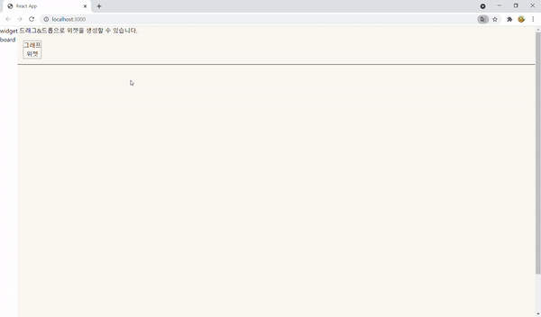

# GraphWidget used to D3.js v6
 - Create components using drag & drop.
 - When creating a widget, data is defined in the following format.

```jsonpath
{
    "nodes": [
      {
        "node_key1": { ...properties } 
      },
      {
        "node_key2": { ...properties }
      },
      {
        "node_key3": { ...properties }
      },
      ...
    ],
    "edges": [
      {
        "edge_key1": { "source": "node_key1", "target": "node_key2" },
        "edge_key2": { "source": "node_key1", "target": "node_key3" },
        ...
      }
    ]
}
```
## Development list
 1. Create widgets by drag&drop. 
 2. Widgets can be moved.
 3. Widgets resizing




## Environment
- React.js 17.0.2
- create-react-app basic template
    ### `npm run start`